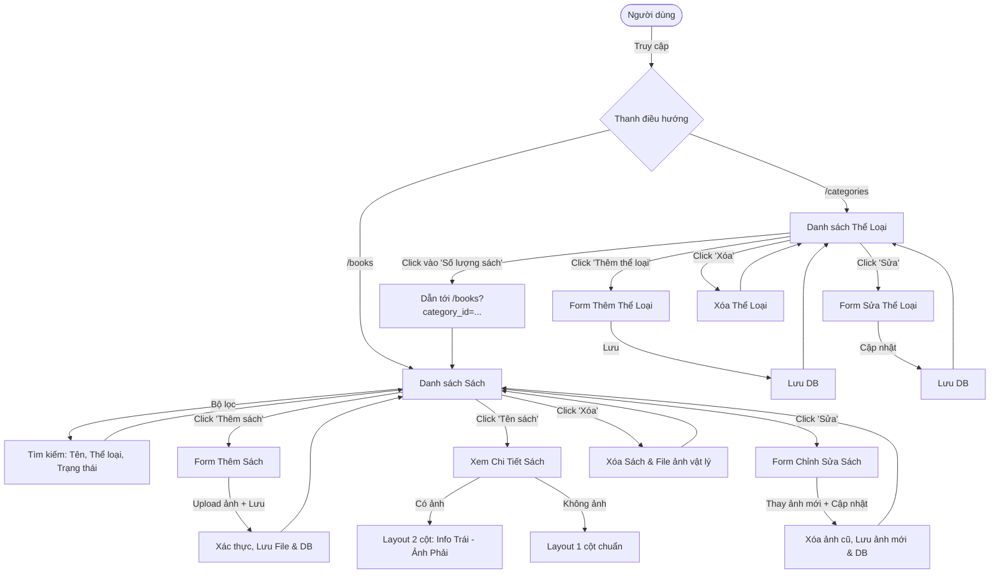
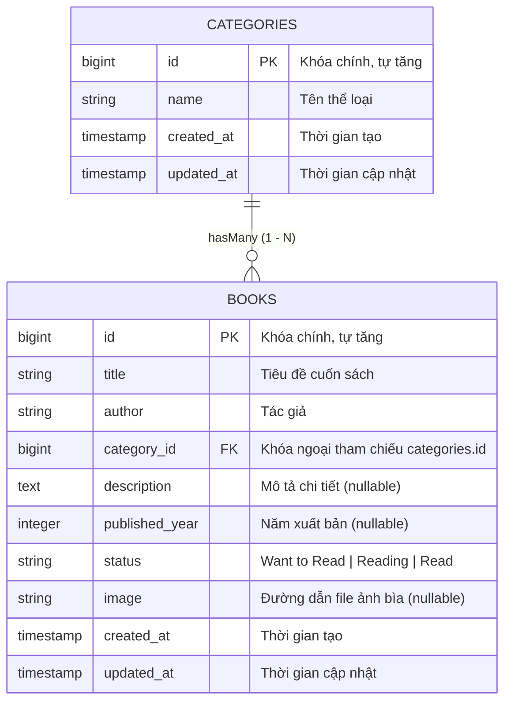

# Book Management System (Hệ thống Quản lý Sách)

Ứng dụng web quản lý thư viện sách và danh mục thể loại được xây dựng trên nền tảng **Laravel**, hỗ trợ quản lý thông tin sách, tải lên ảnh bìa, tìm kiếm, lọc và phân loại chi tiết.

---

## Table of Contents
- [Project Overview](#project-overview)
- [Features](#features)
- [Tech Stack](#tech-stack)
- [Requirements](#requirements)
- [Installation](#installation)
- [Database Setup](#database-setup)
- [Migration](#migration)
- [Storage Setup](#storage-setup)
- [How to Run](#how-to-run)
- [Project Structure](#project-structure)
- [System Flow](#system-flow)
- [ERD](#erd)

---

## Project Overview
Hệ thống Quản lý Sách là một ứng dụng Web MVC tinh gọn giúp người dùng quản lý bộ sưu tập sách cá nhân hoặc thư viện nhỏ:
- Theo dõi tiến độ đọc sách (`Want to Read`, `Reading`, `Read`).
- Phân loại sách theo các thể loại chuyên biệt.
- Tải lên, hiển thị và thay đổi ảnh bìa sách với tính năng xem trước tức thì (instant preview).
- Tra cứu nhanh chóng nhờ bộ lọc kết hợp (tên sách, thể loại, trạng thái).

---

## Features

### 1. Quản lý Sách (Book Management)
- **Hiển thị danh sách**:
  - Cột STT tự động đánh số thứ tự tuần tự theo số lượng hiển thị trên trang (`$loop->iteration`).
  - Hiển thị tên sách, tác giả, thể loại, trạng thái đọc.
  - Thao tác nhanh: Chỉnh sửa và Xóa (kèm hộp thoại xác nhận).
- **Tìm kiếm & Bộ lọc linh hoạt**:
  - Tìm kiếm sách theo từ khóa tên sách.
  - Lọc sách theo danh mục Thể loại.
  - Lọc theo Trạng thái đọc.
  - Nút Xóa lọc giúp đưa danh sách về mặc định nhanh chóng.
- **Thêm sách mới**:
  - Nhập thông tin: Tiêu đề, Tác giả, Thể loại, Mô tả, Năm xuất bản, Trạng thái.
  - Tải lên ảnh bìa sách (hỗ trợ định dạng hình ảnh, dung lượng tối đa 2MB).
  - Xem trước ảnh tải lên ngay trên trình duyệt trước khi lưu.
- **Xem chi tiết sách**:
  - Layout 2 cột trực quan khi sách có ảnh (thông tin bên trái, ảnh bìa bên phải).
  - Tự động co về layout 1 cột chuẩn mực khi sách chưa có ảnh bìa.
  - Các nhãn thông tin quan trọng được in đậm, dễ đọc.
- **Chỉnh sửa sách**:
  - Cho phép cập nhật tất cả thông tin sách.
  - Hiển thị ảnh hiện tại và cho phép tải lên ảnh mới thay thế (tự động dọn dẹp file cũ trên server).
- **Xóa sách**:
  - Xóa bản ghi trong database đồng thời xóa file ảnh vật lý khỏi bộ nhớ lưu trữ `storage`.

### 2. Quản lý Thể loại (Category Management)
- Danh sách thể loại cùng số lượng sách thuộc thể loại đó (`books_count`).
- **Liên kết bộ lọc nhanh**: Nhấp trực tiếp vào con số trong cột "Số lượng sách" sẽ dẫn ngay sang trang danh sách sách đã được lọc sẵn theo thể loại tương ứng.
- Thêm mới, chỉnh sửa tên thể loại và xóa thể loại.

---

## Tech Stack
- **Backend**: [PHP ^8.2 / ^8.3](https://www.php.net/), [Laravel ^11 / ^12](https://laravel.com)
- **Database**: MySQL / MariaDB / SQLite
- **Frontend / Template**: Laravel Blade Template Engine
- **Styling**: Vanilla CSS (Custom design system trong `public/css/app.css` với Google Fonts `Lora` & `Inter`)
- **Icons**: Inline SVG tối ưu hiệu năng
- **Web Server / Dev Environment**: Laragon / Apache / Nginx / PHP Built-in Server

---

## Requirements
Trước khi bắt đầu cài đặt, hãy đảm bảo môi trường của bạn đã có:
- **PHP** >= 8.2 (kèm các extension: `pdo`, `mbstring`, `openssl`, `tokenizer`, `xml`, `ctype`, `json`, `fileinfo`, `gd`/`imagick`)
- **Composer** (bản 2.x trở lên)
- **MySQL / MariaDB** (hoặc SQLite)
- **Node.js & NPM** (tùy chọn nếu cần build asset frontend)

---

## Installation

1. **Clone repository về máy**:
   ```bash
   git clone <repository-url>
   cd project_laravel
   ```

2. **Cài đặt các thư viện PHP phụ thuộc qua Composer**:
   ```bash
   composer install
   ```

3. **Thiết lập file cấu hình môi trường**:
   Sao chép `.env.example` thành `.env`:
   ```bash
   cp .env.example .env
   # Hoặc trên Windows PowerShell / CMD:
   copy .env.example .env
   ```

4. **Tạo Application Encryption Key**:
   ```bash
   php artisan key:generate
   ```

---

## Database Setup

Mở file `.env` và cấu hình kết nối database phù hợp với môi trường của bạn:

**Cấu hình kết nối MySQL (Laragon / XAMPP):**
```env
DB_CONNECTION=mysql
DB_HOST=127.0.0.1
DB_PORT=3306
DB_DATABASE=mini_book_management
DB_USERNAME=root
DB_PASSWORD=
```
*(Lưu ý: Đảm bảo database có tên `mini_book_management` đã được tạo trước trong MySQL/phpMyAdmin hoặc HeidiSQL)*.

**Ví dụ sử dụng SQLite:**
```env
DB_CONNECTION=sqlite
```
*(Nếu dùng SQLite, tạo file trống tại `database/database.sqlite`)*.

---

## Migration

Chạy lệnh artisan migration để khởi tạo các bảng trong cơ sở dữ liệu (`categories`, `books`, `users`,...):

```bash
php artisan migrate
```

*(Tùy chọn) Nếu bạn muốn làm mới toàn bộ database từ đầu:*
```bash
php artisan migrate:fresh
```

---

## Storage Setup

Ứng dụng lưu trữ ảnh bìa sách trong thư mục `storage/app/public/books`. Để trình duyệt có thể truy cập và hiển thị hình ảnh công khai thông qua URL `public/storage/...`, bạn **bắt buộc** phải tạo symbolic link:

```bash
php artisan storage:link
```

---

## How to Run

1. **Khởi chạy ứng dụng**:
   ```bash
   php artisan serve
   ```
   Mặc định server sẽ khởi chạy tại: [http://127.0.0.1:8000](http://127.0.0.1:8000)

2. **Nếu sử dụng Laragon / XAMPP Virtual Host**:
   - Truy cập trực tiếp qua tên miền ảo đã cấu hình (ví dụ: `http://project_laravel.test`).

3. **Truy cập các chức năng chính**:
   - Danh sách sách: `http://127.0.0.1:8000/books`
   - Danh sách thể loại: `http://127.0.0.1:8000/categories`

---

## Project Structure

```
project_laravel/
├── app/
│   ├── Http/
│   │   └── Controllers/
│   │       ├── BookController.php          # Xử lý logic CRUD sách, lọc & upload ảnh
│   │       └── CategoryController.php      # Xử lý logic CRUD danh mục thể loại
│   └── Models/
│       ├── Book.php                        # Model Sách & quan hệ belongsTo Category
│       └── Category.php                    # Model Thể loại & quan hệ hasMany Book
├── database/
│   └── migrations/
│       ├── 2026_08_21_104025_create_categories_table.php
│       ├── 2026_08_21_104026_create_books_table.php
│       └── 2026_09_02_151753_add_image_to_books_table.php
├── public/
│   ├── css/
│   │   └── app.css                         # Toàn bộ CSS giao diện, responsive & component
│   └── storage/                            # Symbolic link trỏ tới storage/app/public
├── resources/
│   └── views/
│       ├── layouts/
│       │   └── app.blade.php               # Layout khung chính (header, nav, container)
│       ├── books/
│       │   ├── index.blade.php             # Danh sách sách, thanh filter & bảng STT
│       │   ├── create.blade.php            # Form tạo sách mới kèm preview ảnh
│       │   ├── edit.blade.php              # Form chỉnh sửa sách & thay đổi ảnh
│       │   └── show.blade.php              # Chi tiết sách (2 cột với ảnh / 1 cột)
│       └── categories/
│           ├── index.blade.php             # Danh sách thể loại & số lượng sách liên kết
│           ├── create.blade.php            # Form thêm thể loại
│           └── edit.blade.php              # Form sửa thể loại
├── routes/
│   └── web.php                             # Định tuyến Resource cho books và categories
├── storage/
│   └── app/
│       └── public/
│           └── books/                      # Nơi lưu trữ các file ảnh bìa sách
├── DEBUG_REPORT.md                         # Báo cáo chi tiết các lỗi đã xử lý & kiểm thử
├── SYSTEM_FLOW.md                          # Tài liệu chi tiết System Flow & Deploy hệ thống
└── README.md
```

---

## System Flow

Quy trình hoạt động giữa người dùng, controller và dữ liệu:



---

## ERD (Entity Relationship Diagram)

Sơ đồ cấu trúc bảng và quan hệ trong cơ sở dữ liệu:


