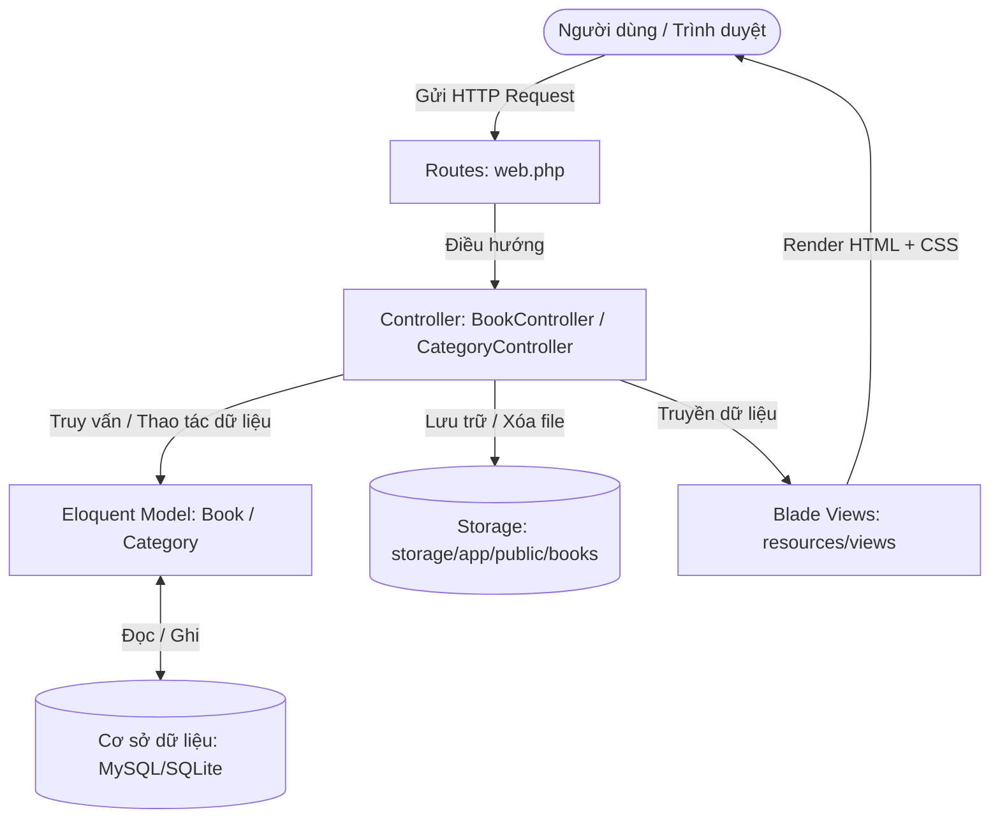
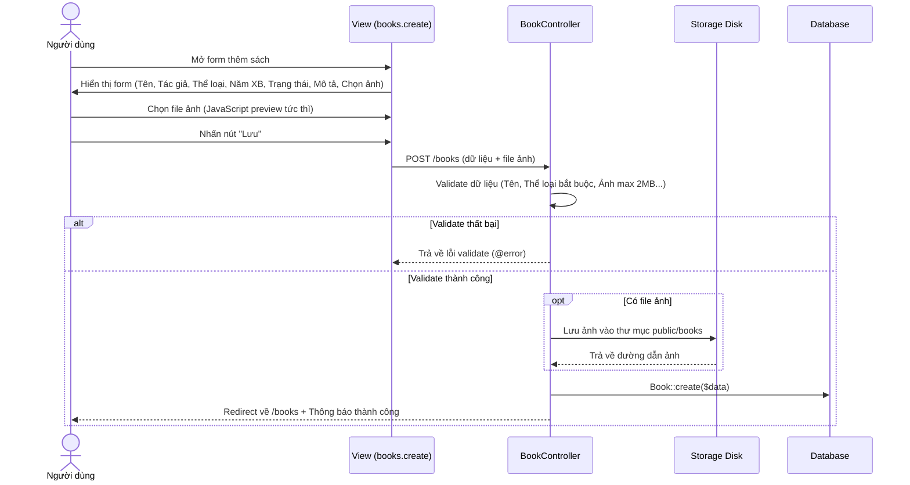
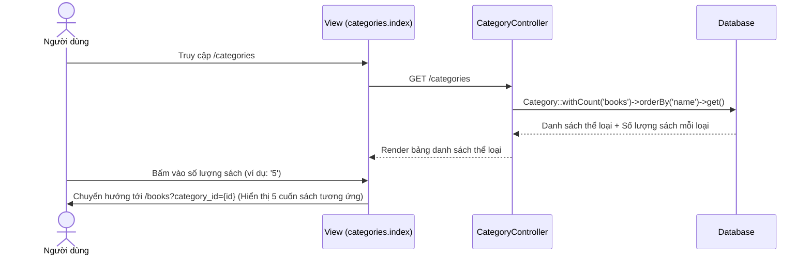
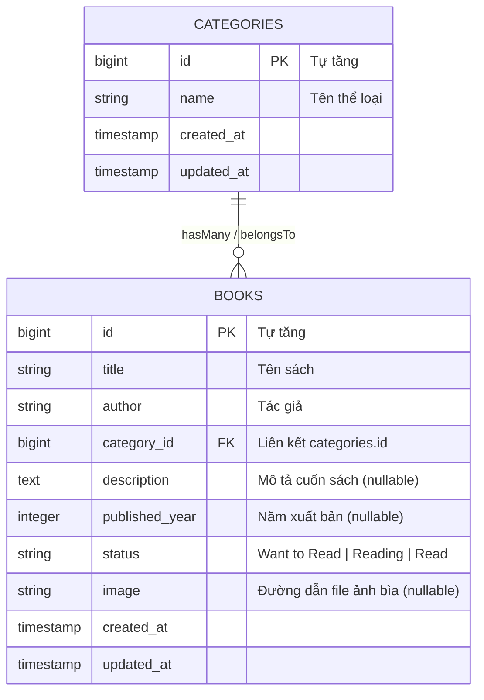
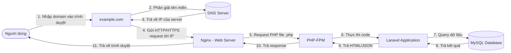

# SYSTEM FLOW - HỆ THỐNG QUẢN LÝ THƯ VIỆN SÁCH (BOOK MANAGEMENT SYSTEM)

Tài liệu mô tả chi tiết kiến trúc, luồng hoạt động (System Flow), các chức năng và cơ sở dữ liệu của ứng dụng Laravel Quản lý Sách và Thể loại.

---

## 1. Tổng quan hệ thống (System Overview)

Hệ thống cung cấp giải pháp quản lý sách cá nhân/thư viện với 2 module cốt lõi:
- **Quản lý Thể loại sách (`Category Management`)**: Phân loại sách theo danh mục, hiển thị số lượng sách theo thể loại và điều hướng nhanh sang danh sách đã lọc.
- **Quản lý Sách (`Book Management`)**: Quản lý thông tin sách, tác giả, năm xuất bản, trạng thái đọc (`Want to Read`, `Reading`, `Read`), tải lên và xem trước ảnh bìa sách, tìm kiếm và lọc đa điều kiện.

---

## 2. Kiến trúc luồng MVC (Architecture Flow)

Ứng dụng tuân theo mô hình chuẩn **MVC (Model - View - Controller)** của Laravel:



---

## 3. Sơ đồ luồng hoạt động tổng thể (Overall System Flow)

```mermaid
flowchart TD
    Start([Truy cập hệ thống]) --> Nav{Thanh điều hướng}
    
    %% Module Sách
    Nav -->|/books| BookList[Trang Danh Sách Sách]
    BookList --> FilterAction[Lọc theo Tên, Thể loại, Trạng thái]
    FilterAction --> BookList
    BookList -->|Click 'Thêm sách'| BookCreate[Form Thêm Sách]
    BookCreate -->|Submit + Upload Ảnh| StoreBook[BookController@store]
    StoreBook --> BookList
    
    BookList -->|Click 'Tên sách'| BookShow[Xem Chi Tiết Sách]
    BookShow -->|Có ảnh| Layout2Col[Layout 2 cột: Thông tin bên trái, Ảnh bên phải]
    BookShow -->|Không có ảnh| Layout1Col[Layout 1 cột: Thông tin trải rộng]
    
    BookList -->|Click icon 'Sửa'| BookEdit[Form Sửa Sách]
    BookEdit -->|Cập nhật + Thay ảnh mới| UpdateBook[BookController@update]
    UpdateBook --> BookList
    
    BookList -->|Click icon 'Xóa'| DeleteBook[Xác nhận & Xóa Sách + Xóa file ảnh]
    DeleteBook --> BookList

    %% Module Thể loại
    Nav -->|/categories| CatList[Trang Danh Sách Thể Loại]
    CatList -->|Click 'Thêm thể loại'| CatCreate[Form Thêm Thể Loại]
    CatCreate -->|Submit| StoreCat[CategoryController@store]
    StoreCat --> CatList
    
    CatList -->|Click vào 'Số lượng sách'| FilterByCat[Điều hướng sang /books?category_id=...]
    FilterByCat --> BookList
    
    CatList -->|Click icon 'Sửa'| CatEdit[Form Sửa Thể Loại]
    CatEdit -->|Submit| UpdateCat[CategoryController@update]
    UpdateCat --> CatList
    
    CatList -->|Click icon 'Xóa'| DeleteCat[Xác nhận & Xóa Thể Loại]
    DeleteCat --> CatList
```

---

## 4. Chi tiết các luồng chức năng (Functional Flows)

### 4.1. Luồng Quản lý Sách (Book Management)

#### A. Xem và Lọc danh sách sách (`GET /books`)
1. Người dùng truy cập `/books`.
2. `BookController@index` nhận request với các tham số tìm kiếm tùy chọn:
   - `search`: Tìm kiếm theo tiêu đề sách (`LIKE %keyword%`).
   - `category_id`: Lọc theo thể loại được chọn.
   - `status`: Lọc theo trạng thái đọc (`Want to Read`, `Reading`, `Read`).
3. Dữ liệu được sắp xếp theo mới nhất (`latest()`).
4. Giao diện hiển thị bảng gồm các cột:
   - **STT**: Đánh số thứ tự hiển thị trực quan (`$loop->iteration`).
   - **Tên sách**: Link dẫn tới trang chi tiết (`books.show`).
   - **Tác giả**, **Thể loại**, **Trạng thái**.
   - **Thao tác**: Icon **Sửa** (`books.edit`) và **Xóa** (`books.destroy`).

#### B. Thêm sách mới (`GET /books/create` & `POST /books`)


#### C. Xem chi tiết sách (`GET /books/{id}`)
- Nếu sách **có ảnh**: Hiển thị layout 2 cột linh hoạt (`detail-content`): bên trái là thông tin sách (Tác giả, Thể loại, Năm XB, Trạng thái, Mô tả được in đậm nhãn), bên phải là ảnh bìa sách (`detail-image`).
- Nếu sách **không có ảnh**: Kích hoạt lớp `.no-image`, hiển thị 1 cột trải dài tự nhiên.

#### D. Chỉnh sửa sách (`GET /books/{id}/edit` & `PUT /books/{id}`)
- Form tự động điền các thông tin hiện tại của cuốn sách.
- Hiển thị ảnh bìa hiện tại (nếu có).
- Cho phép người dùng chọn ảnh bìa mới:
  - Xem trước (preview) ngay trên giao diện.
  - Khi lưu, Controller tự động xóa file ảnh cũ khỏi `storage` và lưu file ảnh mới vào hệ thống.

#### E. Xóa sách (`DELETE /books/{id}`)
- Người dùng nhấn nút "Xóa" -> Popup trình duyệt xác nhận `confirm()`.
- Controller kiểm tra và xóa file ảnh liên kết trong `storage` (nếu có) trước khi xóa bản ghi trong cơ sở dữ liệu.

---

### 4.2. Luồng Quản lý Thể loại (Category Management)



---

### 4.3. Luồng Xử lý Media / Ảnh bìa sách (Media Storage Flow)

```mermaid
flowchart LR
    Input[File tải lên từ Client] --> Validation{Kiểm tra file: image, max 2MB}
    Validation -->|Hợp lệ| StoreStorage[Lưu vào storage/app/public/books]
    StoreStorage --> Symlink[Liên kết symbolic: public/storage/books]
    Symlink --> URLAsset[Truy xuất qua asset: storage/books/filename]
    Validation -->|Không hợp lệ| ReturnError[Trả về thông báo lỗi @error('image')]
```

---

## 5. Sơ đồ cơ sở dữ liệu (Database Schema & ERD)



---

## 6. Danh mục Định tuyến (Routing Table)

| Phương thức HTTP | URI Path | Route Name | Action Controller | Mô tả |
| :--- | :--- | :--- | :--- | :--- |
| `GET` | `/` | `welcome` | `Closure` | Trang chủ mặc định |
| `GET` | `/books` | `books.index` | `BookController@index` | Danh sách sách, tìm kiếm & lọc |
| `GET` | `/books/create` | `books.create` | `BookController@create` | Giao diện thêm sách mới |
| `POST` | `/books` | `books.store` | `BookController@store` | Lưu sách mới & upload ảnh |
| `GET` | `/books/{book}` | `books.show` | `BookController@show` | Xem thông tin chi tiết cuốn sách |
| `GET` | `/books/{book}/edit` | `books.edit` | `BookController@edit` | Giao diện chỉnh sửa sách |
| `PUT/PATCH` | `/books/{book}` | `books.update` | `BookController@update` | Cập nhật sách & thay đổi ảnh |
| `DELETE` | `/books/{book}` | `books.destroy` | `BookController@destroy` | Xóa sách & dọn dẹp ảnh storage |
| `GET` | `/categories` | `categories.index` | `CategoryController@index` | Danh sách thể loại & số lượng sách |
| `GET` | `/categories/create` | `categories.create` | `CategoryController@create` | Giao diện thêm thể loại mới |
| `POST` | `/categories` | `categories.store` | `CategoryController@store` | Lưu thể loại mới |
| `GET` | `/categories/{category}/edit` | `categories.edit` | `CategoryController@edit` | Giao diện sửa thể loại |
| `PUT/PATCH` | `/categories/{category}` | `categories.update` | `CategoryController@update` | Cập nhật tên thể loại |
| `DELETE` | `/categories/{category}` | `categories.destroy` | `CategoryController@destroy` | Xóa thể loại |

---

## 7. Tìm hiểu quy trình Deploy (Deploy Flow)

> Phần này mô tả lý thuyết luồng xử lý khi ứng dụng được triển khai lên môi trường production thực tế (chưa deploy thật, chỉ tìm hiểu và mô tả).

### 7.1. Sơ đồ luồng tổng quát



### 7.2. Giải thích từng bước

| Bước | Thành phần | Vai trò |
|---|---|---|
| 1 | **Domain** | Người dùng gõ tên miền (ví dụ `mybooks.com`) thay vì nhớ địa chỉ IP |
| 2-3 | **DNS Server** | Phân giải (resolve) tên miền thành địa chỉ IP thật của server đang host ứng dụng, trả IP đó về trình duyệt |
| 4 | **Nginx (Web Server)** | Nhận request HTTP/HTTPS đầu tiên tại địa chỉ IP đó. Nginx đóng vai trò "gác cổng" — xử lý các file tĩnh (CSS, JS, ảnh) trực tiếp, còn file `.php` thì chuyển tiếp (proxy) sang PHP-FPM |
| 5 | **Chuyển tiếp** | Nginx dùng giao thức FastCGI để gửi request sang PHP-FPM xử lý logic động |
| 6 | **PHP-FPM** | (FastCGI Process Manager) — quản lý các tiến trình PHP, nhận request từ Nginx và thực thi code Laravel tương ứng (routing, controller...) |
| 6 | **Laravel Application** | Nhận request đã qua PHP-FPM, chạy đúng luồng MVC nội bộ: Route → Controller → Model |
| 7-8 | **MySQL Database** | Laravel (qua Eloquent) truy vấn hoặc ghi dữ liệu vào MySQL, trả kết quả về lại Laravel |
| 9-10 | **Trả response** | Laravel render View (HTML) hoặc trả JSON, gửi ngược lại qua PHP-FPM → Nginx |
| 11 | **Hiển thị** | Nginx trả response cuối cùng về trình duyệt người dùng, hoàn tất 1 vòng request-response |

### 7.3. Vai trò cụ thể của từng thành phần trong hệ thống

- **DNS**: chỉ tham gia đúng 1 lần khi bắt đầu kết nối (phân giải tên miền), không tham gia vào các bước xử lý dữ liệu sau đó.
- **Nginx**: là lớp ngoài cùng tiếp nhận toàn bộ traffic, có thể xử lý luôn các asset tĩnh (`public/css/app.css`, ảnh bìa sách trong `public/storage`) mà không cần "làm phiền" tới PHP-FPM/Laravel, giúp giảm tải và tăng tốc độ phản hồi.
- **PHP-FPM**: là cầu nối giữa Nginx (web server) và code PHP (Laravel) — Nginx bản thân không tự chạy được code PHP, cần PHP-FPM làm trung gian thực thi.
- **Laravel**: xử lý toàn bộ logic nghiệp vụ — nhận request đã được định tuyến (`routes/web.php`), gọi đúng Controller (`BookController`, `CategoryController`), tương tác Model (Eloquent) để truy vấn MySQL.
- **MySQL**: lưu trữ toàn bộ dữ liệu bền vững của hệ thống (bảng `categories`, `books`).

### 7.4. Khác biệt so với môi trường local (Laragon) hiện tại

| | Local (Laragon) | Production (thực tế) |
|---|---|---|
| Web server | Apache/Nginx tích hợp sẵn trong Laragon | Nginx cấu hình riêng trên server |
| Domain | `localhost` / `project_laravel.test` | Tên miền thật đã trỏ DNS |
| PHP | Chạy qua `php artisan serve` (built-in server) hoặc Apache module | PHP-FPM chạy như 1 service riêng, tối ưu cho tải cao |
| Database | MySQL cài trong Laragon, chỉ máy local truy cập | MySQL server riêng (có thể cùng server hoặc server khác), có backup/bảo mật |
| HTTPS | Không bắt buộc | Bắt buộc, dùng chứng chỉ SSL (Let's Encrypt...) |